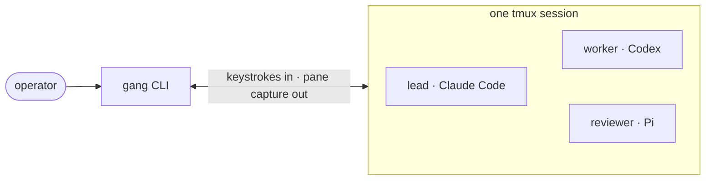

# Gangline

A gangline is the line down the middle of a dog team. Every dog is hitched to it
by its own tug line, the lead runs out front, and one look down the line tells the
musher who is working — a tight tug is pulling, a slack tug is not.

This is that, for CLI coding agents. Claude Code, Codex, opencode and Pi run as
named tmux windows hitched to one session; `gang` hitches them, sends attributed
messages, reads each tug tight or slack, compacts them, and drops them when the
work is done.

One Bash CLI over tmux. No daemon, message bus, database, or harness plugin.

The vocabulary is the command surface, which is why it is worth thirty seconds.
You `hitch` an agent into the line and `drop` it at a checkpoint; `gang roster`
reports a `tight tug` or a `slack tug`. Learn the line and the verbs come free.
And the status column is not decoration on top of a boolean —
[mushers watch tuglines more than anything else](https://northernwilds.com/tugline/),
because a taut tug is a dog pulling and a bouncing one says something is wrong.
That is the same reading `gang status` performs on a pane.



## Why Gangline

- **Use different harnesses together.** A profile declares how to launch and
  observe each CLI; the team workflow stays the same.
- **Keep the glass.** Attach to the session and watch, steer, or take over any
  agent through its real TUI.
- **Know whether a message landed.** With the shipped profiles, Gangline reads
  the target's composer before and after pasting, submits with a separate Enter,
  and checks again. A delivery it cannot verify fails loudly.
- **Keep long-running agents moving.** Context readouts, warning bands, and
  `gang compact --resume-stdin` let an agent hand work to its post-compaction self.
- **Replace policy with files.** Profiles describe harnesses; Markdown role briefs
  describe teammates. `GANG_PROFILES` and `GANG_ROLES` let you shadow either.

## Install

```sh
curl -fsSL https://raw.githubusercontent.com/adambiggs/gangline/main/install.sh | sh
```

The installer clones Gangline to `~/.local/share/gangline`, links `gang` into
`~/.local/bin`, and fast-forwards the clone when run again. Set `GANGLINE_HOME`
or `GANGLINE_BIN` to choose other locations. The npm and PyPI packaging stubs
are not published packages; `install.sh` is the supported install path today.

Prefer not to pipe into a shell? Read [`install.sh`](install.sh), then clone and
link it yourself:

```sh
git clone https://github.com/adambiggs/gangline.git ~/.local/share/gangline
ln -s ~/.local/share/gangline/bin/gang ~/.local/bin/gang
```

Requirements: Bash, git, tmux 2.6 or newer, Python 3, and at least one supported
CLI harness. `gang profiles` lists the harnesses currently offered.

The tmux floor is 2.6, and it is bounded by evidence rather than by a feature. Every
tmux subcommand, flag and format gang calls can be dated in tmux's own source, and
the newest of them is 2.1 — the exact-match `=` target and `#{window_activity}`.
But one thing gang depends on cannot be dated from source at all: that a
`paste-buffer -p` arrives at the harness as a *paste* rather than being interpreted
keystroke by keystroke. 2.6 is the oldest version the whole call set has been
executed on, that property included, so 2.6 is what the installer promises.

That makes the floor lowerable on purpose. Run the call set and the paste property
against something older and the number can follow the evidence down; [issue
#31](https://github.com/adambiggs/gangline/issues/31) has the inventory and both
probes. What will not lower it is reading a changelog — tmux was still correcting how
pasted input is interpreted
[in 3.6](https://github.com/tmux/tmux/blob/master/CHANGES).

Requirement is not the same as coverage. CI exercises the floor itself and one
version below it on every change to the installer, and runs the full suite on tmux
3.4 and 3.7b — so versions between 2.7 and 3.3 meet the enforced floor without the
suite ever running on them.

### Before the first team

Gangline launches a harness with your existing harness configuration. It does
not approve permission prompts for you; a modal makes the agent `gated` until
you answer it. Configure unattended agents with the permission posture you want
before hitching them. See [Operating a team](docs/operations.md#permission-prompts)
for the relevant settings and the Codex sandbox caveat.

Claude Code needs Gangline's statusline beacon before `gang context`, the roster
context column, or context patrol can read its usage. Merge this into
`~/.claude/settings.json` (adjust the path if `GANGLINE_HOME` differs):

```json
{
  "statusLine": {
    "type": "command",
    "command": "/home/YOU/.local/share/gangline/statusline/claude-code-context.sh"
  }
}
```

## Your first team

Start in the repository the team will work on:

```sh
cd ~/my-project
gang up
```

With no arguments, `gang up` hitches a Claude Code agent named `lead`, briefs it
with the `lead` role, and attaches your terminal to the team. Detach with
<kbd>Ctrl-b</kbd>, then <kbd>d</kbd>; reconnect with `gang attach`.

Leave that terminal attached and use a second shell for the walkthrough below
(or ask the lead to run the same commands). The sender label is required. Inside
the team it must match the calling window's name; from an outside operator shell
you choose the label.

```sh
# Add a Codex teammate in the current project and give it the worker brief.
gang hitch worker -p codex -r worker -d "$PWD"

# Send a task. A quoted heredoc keeps shell syntax in prose literal.
gang send worker --from operator --stdin <<'MESSAGE'
inspect the failing tests and propose a fix
MESSAGE

# Observe it without taking over its pane.
gang status worker
gang capture worker 80
gang roster

# Wait for two consecutive idle readings, then compact and resume unattended.
gang wait worker
gang compact worker --from operator --resume-stdin <<'RESUME'
continue from your compacted summary and report the result
RESUME

# Release one teammate and its tmux-owned state.
gang drop worker
```

`gang down` ends the entire team session, including every agent. Use `gang drop`
for the routine case of releasing one finished teammate. On the trail a dropped dog
is one the musher leaves at a checkpoint to be cared for and flown home — done
[for the dog's sake](https://iditarod.com/edu/dropped-dogs-are/), not as a
discard. Same here: dropping an agent whose arc is finished is the healthy
outcome, not a punishment — an agent kept running past its work is a dog riding in
the basket instead of pulling.

## A team of one

A team can have one dog in it. `gang up` with nobody else hitched gives you the
context loop by itself: gang measures the window, notes each band as you cross it,
and near the end compacts you and hands back the thread you asked it to keep —
measure, warn, act, instead of you watching a meter and remembering to act on it.

```bash
gang up
```

Solo needs no permissions decision, because you are attached and watching the pane:
your harness's interactive defaults are the right ones. The team verbs are all still
there and none of them are required — adding a teammate later is `gang hitch`, and
nothing you already set up changes.

## The operating model

### Agents are windows

A team is one tmux session (`gangline` by default), and each agent is one named
window. The window name is its identity and command handle. Names may contain
letters, digits, `.`, `_`, and `-`, but may not start with `.` or `-`.

Gangline resolves a name to tmux's immutable window ID before acting. Per-agent
facts such as its profile, warning band, pending compaction, and an undelivered
paste live in window options and disappear with the window.

### Messages are attributed and verified

`gang send` wraps the body in a nonce-bearing envelope:

```text
[gang:lead#d8095dd5] inspect the failing test [/gang:lead#d8095dd5]
```

Tag-shaped text in the body is neutralised, so the body cannot end its own
envelope. This is attribution, not authentication: Gangline is single-operator
software, and anyone able to type into a pane is already trusted.

`gang send` reads the body from stdin and refuses message prose in argv. Use a
single-quoted heredoc for literal prose: an unquoted heredoc still expands
backticks, `$()`, `$variables`, globs, and other shell syntax before delivery
verification can see the mistake. See
[Shell-safe messages](docs/operations.md#shell-safe-messages).

For profiles with a composer reader, delivery is a measured sequence: read the
composer, paste, require it to change, send Enter separately, then require a
later read to differ from the pasted state. Gangline serialises its own writers
per pane and refuses a moving composer or a modal. A static draft can still be
appended to, so do not leave drafts in unattended agents.

If failure strands a paste, Gangline clears it only when it can prove the live
composer still contains exactly that paste. Otherwise `status`, `roster`, and
`patrol` report an **undelivered paste** until the box is empty.

### State is conservative

`gang status <name>` reports:

- `busy (tight tug)` when a declared busy marker is painted, a profile verified
  quiet at rest wrote to the pty recently, or the pane changes between samples;
- `idle (slack tug)` when none of those working signals applies;
- `gated (hook set)` when a modal owns the input area or a profile with a composer
  reader cannot otherwise identify a safe input box;
- `parked (waiting on <agent>)` when the agent is blocked inside its own `gang wait`;
- `expired (pty activity bound reached)` when pty activity alone had been carrying
  the busy verdict and has spent its bound.

The last two exist because neither one is answerable with a word that already
existed. A parked agent is not idle — *available* and *idle* are different claims,
and calling it idle offers a teammate a promise the harness may not keep. An expired
agent is neither busy nor idle: gang cannot determine which, so it says so instead of
picking, and a send to it is refused unless the profile declares a safe composer.
Resolving either one quietly to `idle` is how a wrong reading would become permanent.

A gate is never answered by Gangline. Attach and clear it yourself. Status is an
observation of a TUI, not a scheduler guarantee; where safety matters, delivery
still verifies the composer directly.

### Busy agents can still receive messages

The shipped Claude Code, Codex, opencode, and Pi profiles declare that their
composers accept input during a turn. A send to one is verified and reported as
**accepted mid-turn**; whether the harness uses it immediately or at a boundary
is the harness's decision. A custom profile without that declaration is refused
while busy unless you use `--wait`.

### Context is explicit

`gang context <name>` asks the profile for `<used>k/<window>k (<percent>%)`.
`gang patrol` applies `GANG_CONTEXT_BANDS` (default `30%,50%,70%,85%`) and sends
one attributed warning per crossed band. The rungs are proportional because
context windows differ by nearly 4x across the shipped harnesses, and one absolute
ladder means four different things on a mixed team: a 350k rung is never reached on
a 258k window, while on a 1M window it fires after the room to act on it is gone.
Absolute token counts still work if you run one window size. Patrol skips a
painted-busy, churning, gated, gang-compacting, or non-empty input area without
advancing the band, so a later sweep retries.

Run patrol periodically if you want ambient warnings:

```sh
mkdir -p "$HOME/.local/state/gangline"
```

```cron
*/2 * * * * $HOME/.local/bin/gang patrol 2>&1 | grep -v ' steady ' >> $HOME/.local/state/gangline/patrol.log || true
```

The cron environment must carry the same `GANG_SESSION`, `GANG_PROFILES`,
`GANG_CONTEXT_BANDS`, `GANG_LOCK_DIR`, and `GANG_CONTEXT_LOG` values as the team
when you override them. A patrol that disagrees about the lock directory stops
serialising with the other writers.

At a clean checkpoint, an agent whose harness accepts compaction during an
active task can compact itself in one command:

```sh
gang compact lead --from lead --resume-stdin <<'RESUME'
tests pass; next verify the packaging path
RESUME
```

Self-compaction may queue behind the caller's current turn. Codex 0.145.0 is a
known exception: it rejects `/compact` while a task is active, and running
`gang compact` from its own pane is itself such a task. Let Codex auto-compact or
have another caller compact it after it becomes idle. Do not use a self-issued
Codex `--resume-stdin`: Gangline verifies command delivery, not whether Codex accepted
the native command. Compacting any busy peer is refused because it would cut off
live work. Resume delivery is attempted by a detached waiter rather than pasted
behind the slash command, where the current turn could consume it first. A
failed resume is reported by `gang status` and
`gang patrol`.

## Commands

`gang` with no arguments prints the complete CLI synopsis. Common commands:

| Command | Purpose |
|---|---|
| `gang up [name] [hitch options]` | Hitch a briefed lead and attach or switch to it. |
| `gang hitch <name> [-p profile] [-r role] [-d dir] [-m model]` | Start and optionally brief an agent (`spawn` is an alias). |
| `gang send <name> --from <sender> [--wait] --stdin` | Send an attributed, verified message read from stdin. |
| `gang status <name>` / `gang roster` | Read one agent or the whole team. |
| `gang wait <name> [seconds]` | Block until idle; default 300 seconds. |
| `gang capture <name> [lines]` | Print pane tail; default 40 lines. |
| `gang compact <name> [--from sender] [--resume-stdin]` | Run the profile's compaction command, optionally reading a handoff from stdin. |
| `gang drop <name>` / `gang down` | End one window / the whole session. |

See the [command and environment reference](docs/reference.md) for every verb,
option, environment variable, output detail, and alias.

## Profiles, roles, and diagnostics

### Profiles and roles

The shipped harness profiles are `claude-code`, `codex`, `opencode`, and `pi`.
A profile owns the harness-specific launch command, model flag, observable busy
and gated states, compaction command, mid-turn input declaration, and optional
context and composer readers. `GANG_PROFILES=/path/to/profiles` shadows shipped
files by name.

The shipped role briefs are `lead`, `worker`, and `reviewer`; all include
`roles/_common.md`. `GANG_ROLES=/path/to/roles` shadows them by name. Gangline
points a new agent at the brief files rather than pasting their contents, so the
agent can reread them after compaction.

### Strategy rot

Profiles observe terminal chrome and harness-owned files, both of which can
change. `gang vet` compares installed harness versions with each profile's pins
and runs declared file-format gates. `gang vet --probe [profile]` additionally
launches installed harnesses on a private tmux socket, drives a real turn, and
checks the declared busy marker and context readout. It spends tokens and does
not exercise gated or compacting states. See
[Operating a team](docs/operations.md#diagnosing-profile-rot).

## Security boundary

Gangline does not isolate agents from one another. They share the account,
checkout, files, network, and tmux server allowed by their harness configuration.
Treat one agent's output as untrusted input to the next. If you need a security
boundary, use an actual boundary such as a container, VM, or separate account;
a different `$HOME` under the same uid is not one.

## Project guide

- [Command and environment reference](docs/reference.md)
- [Operating a team](docs/operations.md)
- [Musher's field guide](docs/field-guide.md) — metaphor translated literally
- [Contributing](CONTRIBUTING.md)
- [Constitution](CONSTITUTION.md)
- [Architecture decisions](docs/adr/)

Apache-2.0 — see [`LICENSE`](LICENSE). Copyright 2026 Adam Biggs.
