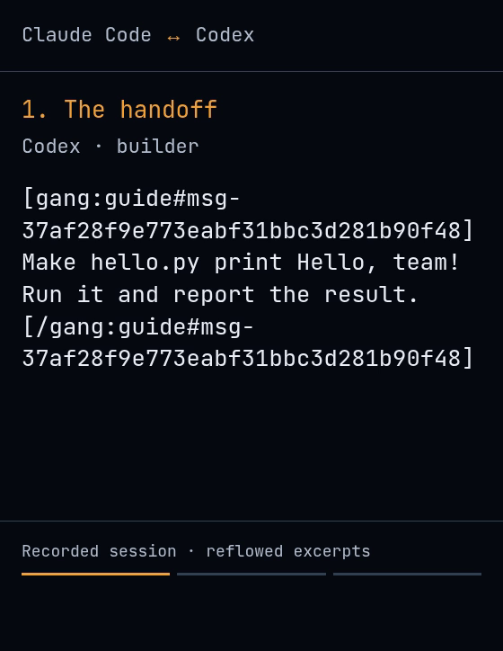

# Gangline

**Many CLI coding agents. One coordinated team.**

Gangline is the substrate under a long-running, multi-harness agent team — not the
orchestration on top of it. Claude Code, Codex, opencode and Pi run as named
windows in one tmux session. `gang` hitches them, *proves* each attributed message
into the target's input box, reports what can and cannot be established about
their state, and carries them across their own context limits. Who does what, and
in what order, is your call — it lives in a markdown brief you can replace with a
directory of your own.

One Bash script over tmux. No daemon, no port, no message bus, no harness plugin,
and `gang` exits after every command. Attach whenever you like and you are inside
the real TUI — the agent's own, at full fidelity, with every keystroke still
yours.

[](https://gangline.ai)

<p align="center"><em>One message to a Claude Code lead: it hitches a Codex worker, waits for
the work, then hitches an opencode reviewer to check it. Real harnesses, real
subscriptions, unedited except for cuts through the waiting —
<a href="https://gangline.ai">watch the whole thing at gangline.ai</a>.</em></p>

## What goes wrong without it

Three agents at once is three terminal tabs, and the moment you look away you are
guessing. Is that one working, or waiting on a permission prompt? Did the message
you pasted actually go in, or is it still sitting unsent in the composer with your
next one about to land on top of it? Which one is three thousand tokens from
losing the thread? You become the message bus — copying output from one tab into
another, watching meters, remembering to compact, and discovering an hour later
that the answer you sent never arrived.

Gangline is the substrate that does that job instead: one session, named windows,
messages verified into the box rather than sprayed at it, states that admit what
they could not determine, and context warnings delivered to the agent rather than
to you.

## The 60-second version

```sh
cd ~/my-project
gang up                                       # hitch a briefed Claude Code lead, attach
gang hitch worker -p codex -r worker          # add a Codex teammate on the same repo

gang send worker --from lead --stdin <<'MESSAGE'
read the failing test in ci and fix it
MESSAGE
# delivered to worker as [gang:lead] (verified in pane, submitted)

gang roster
# lead    claude-code  idle (slack tug)  142k/1000k (14%)
# worker  codex        busy (tight tug)   31k/272k  (11%)

gang wait worker                              # idle — or parked, or expired; read which
gang drop worker                              # release it once its arc is done
```

## Where this sits

**Gangline is a substrate, not an orchestration framework.** The orchestration —
who does what, in what order, and what happens when one of them stalls — lives in
the agent and in a markdown role brief you can replace wholesale with
`GANG_ROLES`. Gangline owns the layer underneath: how an agent is started, how a
message is *proven* into its input box, what may and may not be claimed about its
state, and what becomes of its context over the following six hours.

That boundary is not a positioning statement, it is written into the
[Constitution](CONSTITUTION.md). Law 9 gives the mission as *drive long-horizon
multi-agent sessions with minimal machinery*, and settles ties with "the answer is
prose in an agent's prompt, not code in this repo". Law 7 goes further and forbids
Gangline from growing any component whose job is watching, policing or
coordinating another Gangline component — which is what a supervisor loop is. An
orchestrator is a thing that decides what runs next; `gang` never decides that,
and is not allowed to.

Which is why the shipped `lead` / `worker` / `reviewer` briefs are deliberately
thin. They are a worked example of one way to divide labour, not the product, and
swapping them costs a directory. The product is everything they are standing on.

None of which makes Gangline unopinionated. It is opinionated to a fault — just
not about your workflow. It is opinionated about what a tool is allowed to
*claim*: that a delivery is not delivered until the box has been seen to change,
that an unreadable pane is a third answer rather than a convenient one, that
"a UI owns this input box" and "a human must clear it" are different findings and
only the first has been established.

### The axis is duration, not breadth

Orchestration competes on breadth: fan out, join, retry, dependency graphs,
structured output. Every mechanism Gangline actually invented is about surviving
**time** instead.

- **Self-compaction** ([ADR-0003](docs/adr/0003-self-compaction-is-a-pillar-not-a-product.md))
  — an agent compacts *itself* at a clean seam and hands its own successor the
  thread, through a detached waiter so the resume cannot be swallowed by the turn
  being compacted.
- **Absolute context bands**
  ([ADR-0005](docs/adr/0005-context-bands-are-absolute.md),
  [ADR-0006](docs/adr/0006-the-band-ladder-spans-absolute-bounds.md)) — warnings
  keyed to how long a context *is*, not how full its window is, so a bigger
  window buys a warning on the same schedule rather than permission to fill it.
- **Strategy-rot detection** — `gang vet --probe` fires each profile's markers at
  a live harness on a private socket, because the thing most likely to break a
  long-running team is the vendor moving a pixel of chrome next Tuesday.

A team that finishes inside one context window needs none of this. A team still
working tomorrow morning needs all three, and no amount of fan-out substitutes.

### How is this different from …

Every tool below solves a real problem, and for several of them the honest answer
is "use that one instead" — or "use that one *on top of this*", which is not a
contradiction. Each is described in the terms it uses for itself.

| | what it owns | agents run as | what stays running |
|---|---|---|---|
| **Gangline** | the substrate: delivery, state, context, rot | tmux windows you attach to — Claude Code, Codex, opencode, Pi | nothing; `gang` exits |
| [Claude Code agent teams](https://code.claude.com/docs/en/agent-teams) | orchestration: shared task list, claiming, plan approval | rows in the lead's terminal, or split panes — Claude Code | the lead session |
| [claude-squad](https://github.com/smtg-ai/claude-squad) | isolation: a git worktree and tmux session per agent | tmux sessions in a Go TUI — Claude Code, Codex, Gemini, Aider, any command | the TUI |
| [amux](https://github.com/mixpeek/amux) | a control plane: dashboard, scheduler, watchdog | tmux sessions behind a web UI — Claude Code, Codex, Gemini CLI | a server on a port |
| [CCB](https://github.com/SeemSeam/claude_codex_bridge) | collaboration graphs across many vendors | native terminal panes — Codex, Claude, Gemini, opencode, Pi and more | a background daemon |
| Agent SDK, LangGraph, CrewAI | orchestration in code you write | API calls in your program — model APIs, not CLIs | your program |

**What they do better.**

- **Claude Code agent teams** are the orchestration layer Gangline deliberately
  does not ship: a shared task list with dependencies and file-locked claiming,
  plan approval before a teammate may implement, hooks that fire when a teammate
  goes idle or a task completes. If every member of your team is Claude Code,
  start there — it is more integrated than an external process can be.
  What it is not is cross-vendor, and its coordinator is the lead's own session.
- **claude-squad** gives each agent its own git worktree. Gangline gives you none.
  If what you need is four agents on one repo that cannot collide, that is the
  tool and this is not.
- **amux** is a control plane and does far more at that layer: live status and
  token stats in a browser, a cron scheduler, a kanban board, an iOS app, and a
  watchdog that compacts context and restarts sessions on its own. Gangline warns;
  your agent is the one that acts.
- **CCB** drives a far wider set of harnesses than Gangline's four and arranges
  them into explicit collaboration graphs — `A -> B -> C`, `A,B -> C`, `A -> B,C`
  — with a background daemon that keeps project state alive after you close the
  UI, plus a mobile app with remote terminal access and file transfer.
- **SDK frameworks** are the right answer when what you want is a program rather
  than a team: deterministic control flow, retries, structured output, tests. What
  you give up is the harness itself — there is no TUI to watch or type into,
  because there is no harness in the loop.

**Where Gangline is the wrong tool.** No worktree isolation: every agent shares one
checkout, and keeping two of them off the same file is yours to arrange. No
dashboard, no notifications, no history to browse afterwards — per-agent state
lives in tmux window options and dies with the window, which is the deletion path
working as designed and also means nothing is kept for you. No auto-restart: an
agent that falls over is one you hitch again. Profile version pins go stale every
time a harness ships; `gang vet` tells you, but re-verifying is yours. And it is
Bash on tmux, so Windows means WSL.

Not on that list: no task list, no dependency graph, no retry policy, no
supervisor loop. Those are absent on purpose — they are the layer above, and
putting them here would make the substrate opinionated about the one thing it
should stay out of.

**What I have not found elsewhere.** Three, stated as findings rather than boasts —
if one of these exists in a tool above, the claim is wrong and I would like the
issue.

1. **A probe that fails when the harness's UI moves under it.** Everything that
   reads a terminal is guessing at chrome its vendor can change without notice.
   `gang vet` compares each installed harness against the versions its profile was
   verified against. `gang vet --probe` goes further: it launches the harness on a
   private tmux socket, drives a real turn, and requires the declared busy marker
   to *transition* — painted while the harness works, gone once the screen stops
   moving. A marker that never appears on a pane that was visibly working is
   `MARKER DEAD`; one still painted after the screen goes still is `MARKER STUCK`;
   and a pane that never got busy at all is `not probed`, which is a third answer
   rather than a quiet pass.
2. **"I cannot tell" is a state, not a default.** A predicate that could not reach
   an answer says so rather than returning the convenient one. An agent whose busy
   verdict was carried by pty activity alone reads `expired`, not `idle`, once that
   evidence spends its bound; an agent whose input box is owned by a UI reads
   `occupied (authority unknown)`, because Gangline can establish that the box is
   taken and not who may free it. The defect this repo watches for is a result that
   could not be determined, spent as though it had been.
3. **Delivery is measured, not fired.** A send reads the composer, pastes,
   requires the box to have *changed*, submits Enter as its own keystroke, then
   polls until the box differs from the pasted state. Unreadable and unchanged are
   separate failures and both are loud. A paste stranded by a failure is cleared
   only when the live composer can be proven to still contain exactly that paste;
   otherwise `status`, `roster` and `patrol` all report an undelivered paste until
   the box is empty.

**The client is a terminal.** Gangline ships no app, no web UI and no mobile
client, so there is nothing between you and the agent. SSH or mosh in from a
phone, `gang attach`, and you are in the same tmux session you would be in at your
desk: the harness's own interface, every pane, every keystroke. A mobile client
gives you a view of what is happening, chosen by whoever wrote it. A terminal
gives you what is happening. The cost of that stance is the whole list of gaps
above — no push notification will ever tell you an agent went idle.

**What would make half of this unnecessary.** Gangline scrapes panes because the
harnesses it drives expose no stable programmatic surface to do it any other way,
and [ADR-0001](docs/adr/0001-tmux-is-the-substrate.md) accepts the consequence out
loud: text conventions are version-fragile, a TUI update can move a busy marker,
and what makes that survivable is that the break is loud and the fix is one line
in a profile. `gang vet --probe` exists because of that acceptance, not in spite
of it. [ACP](https://agentclientprotocol.com) — which standardises
editor-to-agent communication over JSON-RPC much as LSP did for language tooling
— is the closest thing to the surface that would make the scraping unnecessary. If
the harnesses converge on it, the reading half of this design should be replaced
by it, and that would be a good outcome rather than an embarrassing one.

## Install

```sh
curl -fsSL https://raw.githubusercontent.com/adambiggs/gangline/main/install.sh | sh
```

The installer clones Gangline to `~/.local/share/gangline`, links `gang` into
`~/.local/bin`, and fast-forwards the clone when run again. Set `GANGLINE_HOME`
or `GANGLINE_BIN` to choose other locations. The npm and PyPI packaging stubs are
not published packages; `install.sh` is the supported install path today.

Prefer not to pipe into a shell? Read [`install.sh`](install.sh), then clone and
link it yourself:

```sh
git clone https://github.com/adambiggs/gangline.git ~/.local/share/gangline
ln -s ~/.local/share/gangline/bin/gang ~/.local/bin/gang
```

Requirements: Bash, git, tmux 2.6 or newer, Python 3, and at least one supported
CLI harness. `gang profiles` lists the harnesses currently offered.

<details>
<summary>Why the tmux floor is 2.6, and how to lower it</summary>

The floor is bounded by evidence rather than by a feature. Every tmux subcommand,
flag and format `gang` calls can be dated in tmux's own source, and the newest of
them is 2.1 — the exact-match `=` target and `#{window_activity}`. But one thing
`gang` depends on cannot be dated from source at all: that a `paste-buffer -p`
arrives at the harness as a *paste* rather than being interpreted keystroke by
keystroke. 2.6 is the oldest version the whole call set has been executed on, that
property included, so 2.6 is what the installer promises.

That makes the floor lowerable on purpose. Run the call set and the paste property
against something older and the number can follow the evidence down; [issue
#31](https://github.com/adambiggs/gangline/issues/31) has the inventory and both
probes. What will not lower it is reading a changelog — tmux was still correcting
how pasted input is interpreted [in
3.6](https://github.com/tmux/tmux/blob/master/CHANGES).

Requirement is not the same as coverage. CI exercises the floor itself and one
version below it on every change to the installer, and runs the full suite on tmux
3.4 and 3.7b — so versions between 2.7 and 3.3 meet the enforced floor without the
suite ever running on them.

</details>

## Your first team

Start in the repository the team will work on:

```sh
cd ~/my-project
gang up
```

With no arguments, `gang up` hitches a Claude Code agent named `lead`, briefs it
with the `lead` role, and attaches your terminal to the team. Detach with
<kbd>Ctrl-b</kbd>, then <kbd>d</kbd>; reconnect with `gang attach`.

Leave that terminal attached and use a second shell for the walkthrough below (or
ask the lead to run the same commands). The sender label is required. Inside the
team it must match the calling window's name; from an outside operator shell you
choose the label.

```sh
# Add a Codex teammate in the current project and give it the worker brief.
gang hitch worker -p codex -r worker -d "$PWD"

# Send a task. A quoted heredoc keeps shell syntax in prose literal.
gang send worker --from operator --stdin <<'MESSAGE'
inspect the failing tests and propose a fix
MESSAGE

# Observe it without taking over its pane.
gang status worker
gang capture worker 80
gang roster

# Wait for it to settle, then compact and resume unattended.
gang wait worker
gang compact worker --from operator --resume-stdin <<'RESUME'
continue from your compacted summary and report the result
RESUME

# Release one teammate and its tmux-owned state.
gang drop worker
```

`gang down` ends the entire team session, including every agent. Use `gang drop`
for the routine case of releasing one finished teammate. On the trail a dropped
dog is one the musher leaves at a checkpoint to be cared for and flown home — done
[for the dog's sake](https://iditarod.com/edu/dropped-dogs-are/), not as a
discard. Same here: dropping an agent whose arc is finished is the healthy
outcome, not a punishment — an agent kept running past its work is a dog riding in
the basket instead of pulling.

### A team of one

A team can have one dog in it. `gang up` with nobody else hitched gives you the
context loop by itself: Gangline measures the window, notes each band as you cross it,
and near the end compacts you and hands back the thread you asked it to keep —
measure, warn, act, instead of you watching a meter and remembering to act on it.

Solo needs no permissions decision, because you are attached and watching the
pane: your harness's interactive defaults are the right ones. The team verbs are
all still there and none of them are required — adding a teammate later is
`gang hitch`, and nothing you already set up changes.

## Before you leave one unattended

Two things are worth setting up once, and neither is needed to run `gang up`.

**Permissions.** Gangline launches a harness with your existing harness
configuration. It does not approve permission prompts for you; a modal makes the
agent `occupied`, and Gangline refuses sends into it until the modal is cleared.
Configure unattended agents with the permission posture you want before hitching
them. See [Operating a team](docs/operations.md#permission-prompts) for the
relevant settings and the Codex sandbox caveat.

The shipped opencode profile carries one narrow exception, and Gangline creates
the need for it itself. `gang hitch -r <role>` points an agent at a brief by
path, and briefs live in Gangline's own tree — outside the directory opencode
started in, which is the only place opencode reads without asking. So every
role-briefed opencode agent stopped on `Access external directory`, for the file
it had just been told to read, with nobody there to answer. The profile
pre-authorises those role directories and nothing else, for that one process,
merged into your config rather than replacing it. It is not `--auto`, and no
other posture changes.

**Context reading.** Claude Code needs Gangline's statusline beacon before
`gang context`, the roster context column, or context patrol can read its usage. Merge
this into `~/.claude/settings.json` (adjust the path if `GANGLINE_HOME` differs):

```json
{
  "statusLine": {
    "type": "command",
    "command": "/home/YOU/.local/share/gangline/statusline/claude-code-context.sh"
  }
}
```

`gang vet` confirms it, and prints this edit with the right path for your install
if it is missing.

## The operating model

### Agents are windows

A team is one tmux session (`gangline` by default), and each agent is one named
window. The window name is its identity and command handle. Names may contain
letters, digits, `.`, `_`, and `-`, but may not start with `.` or `-`.

Gangline resolves a name to tmux's immutable window ID before acting. Per-agent
facts such as its profile, warning band, pending compaction, and an undelivered
paste live in window options and disappear with the window.

### Messages are attributed and verified

`gang send` wraps the body in a nonce-bearing envelope:

```text
[gang:lead#d8095dd5] inspect the failing test [/gang:lead#d8095dd5]
```

The nonce is minted from a body that already exists, so the body cannot close its
own envelope; tag-shaped text is neutralised on top of that, matching the shape of
a tag rather than one spelling of it.

Where `gang` can see the sending window it reads the sender's name off that window
and refuses a mismatch. Where it cannot — your own shell, cron — the `--from` name
stands as given. This is attribution, not authentication: Gangline is
single-operator software, and anyone able to type into a pane is already trusted.

`gang send` reads the body from stdin and refuses message prose in argv. Use a
single-quoted heredoc for literal prose: an unquoted heredoc still expands
backticks, `$()`, `$variables`, globs, and other shell syntax before delivery
verification can see the mistake. See [Shell-safe
messages](docs/operations.md#shell-safe-messages).

For profiles with a composer reader, delivery is a measured sequence: read the
composer, paste, require it to change, send Enter separately, then require a later
read to differ from the pasted state. Gangline serialises its own writers per pane
and refuses a moving composer or an occupied input box. A static draft can still
be appended to, so do not leave drafts in unattended agents.

If failure strands a paste, Gangline clears it only when it can prove the live
composer still contains exactly that paste. Otherwise `status`, `roster`, and
`patrol` report an **undelivered paste** until the box is empty.

### State is conservative

`gang status <name>` reports:

- `busy (tight tug)` when a declared busy marker is painted, a profile verified
  quiet at rest wrote to the pty recently, or the pane changes between samples;
- `idle (slack tug)` when none of those working signals applies;
- `occupied (authority unknown)` when a harness-owned UI has taken the input area,
  or a profile with a composer reader cannot otherwise identify a safe input box.
  Occupancy is the whole of what Gangline establishes here; who may clear the UI,
  and whether it clears itself, is a separate question no shipped profile answers
  yet ([ADR-0004](docs/adr/0004-occupancy-is-not-authority.md));
- `parked (waiting on <agent>)` when the agent is blocked inside its own `gang wait`;
- `expired (pty activity bound reached)` when pty activity alone had been carrying
  the busy verdict and has spent its bound.

The last two exist because neither one is answerable with a word that already
existed. A parked agent is not idle — *available* and *idle* are different claims,
and calling it idle offers a teammate a promise the harness may not keep. An
expired agent is neither busy nor idle: Gangline cannot determine which, so it says so
instead of picking, and a send to it is refused unless the profile declares a safe
composer. Resolving either one quietly to `idle` is how a wrong reading would
become permanent.

Occupancy is never answered by Gangline. Attach and clear it yourself. Status is
an observation of a TUI, not a scheduler guarantee; where safety matters, delivery
still verifies the composer directly.

### Busy agents can still receive messages

The shipped Claude Code, Codex, opencode, and Pi profiles declare that their
composers accept input during a turn. A send to one is verified and reported as
**accepted mid-turn**; whether the harness uses it immediately or at a boundary is
the harness's decision. A custom profile without that declaration is refused while
busy unless you use `--wait`.

### Context is explicit

`gang context <name>` asks the profile for `<used>k/<window>k (<percent>%)`.
`gang patrol` runs a five-rung ladder over that reading and sends one attributed
warning naming the highest rung crossed — a single read can clear several rungs at
once, and that is one warning, not a queue of them. What the warning *asks*
changes with the rung: below the top it asks for a compaction at the next arc
boundary and says how many bands are left before that stops being optional, and at
the top it asks the agent to stop where it is, write its handoff assets, and
compact immediately. Escalating the ask rather than the volume is the point — a
louder note carrying the same deferrable instruction defers exactly as well, and
"at the next checkpoint" is satisfiable forever because there is always a next
checkpoint.

Both ends of the ladder are absolute token counts, because context rot tracks how
long a context is and not how full its window is: every agent's first warning
lands at `GANG_CONTEXT_FLOOR` (120000), and none goes unwarned past
`GANG_CONTEXT_CAP` (350000) however large its window — a bigger window is a reason
to warn on the same schedule, not a licence to fill it. Between those two the
rungs are spread across `min(90% of the window, cap)`, closer together toward the
top, because there the hazard is running out of room rather than rot
([ADR-0006](docs/adr/0006-the-band-ladder-spans-absolute-bounds.md)). Setting
`GANG_CONTEXT_BANDS` replaces the ladder outright, and a percentage of the window
works there as an escape hatch for an unusual one
([ADR-0005](docs/adr/0005-context-bands-are-absolute.md)). Patrol skips a
painted-busy, churning, occupied, gang-compacting, or non-empty input area without
advancing the band, so a later sweep retries.

Run patrol periodically if you want ambient warnings:

```sh
mkdir -p "$HOME/.local/state/gangline"
```

```cron
*/2 * * * * $HOME/.local/bin/gang patrol 2>&1 | grep -v ' steady ' >> $HOME/.local/state/gangline/patrol.log || true
```

The cron environment must carry the same `GANG_SESSION`, `GANG_PROFILES`,
`GANG_CONTEXT_BANDS` and `GANG_LOCK_DIR` values as the team
when you override them. A patrol that disagrees about the lock directory stops
serialising with the other writers.

At a clean checkpoint, an agent whose harness accepts compaction during an active
task can compact itself in one command:

```sh
gang compact lead --from lead --resume-stdin <<'RESUME'
tests pass; next verify the packaging path
RESUME
```

Self-compaction may queue behind the caller's current turn. Codex 0.145.0 is a
known exception: it rejects `/compact` while a task is active, and running
`gang compact` from its own pane is itself such a task. Let Codex auto-compact or have
another caller compact it after it becomes idle. Do not use a self-issued Codex
`--resume-stdin`: Gangline verifies command delivery, not whether Codex accepted
the native command. Compacting any busy peer is refused because it would cut off
live work. Resume delivery is attempted by a detached waiter rather than pasted
behind the slash command, where the current turn could consume it first. A failed
resume is reported by `gang status` and `gang patrol`.

## Commands

`gang` with no arguments prints the complete CLI synopsis. Common commands:

| Command | Purpose |
|---|---|
| `gang up [name] [hitch options]` | Hitch a briefed lead and attach or switch to it. |
| `gang hitch <name> [-p profile] [-r role] [-d dir] [-m model]` | Start and optionally brief an agent (`spawn` is an alias). |
| `gang send <name> --from <sender> [--wait] --stdin` | Send an attributed, verified message read from stdin. |
| `gang status <name>` / `gang roster` | Read one agent or the whole team. |
| `gang wait <name> [seconds]` | Block until idle holds twice; `parked` and `expired` end it too. |
| `gang capture <name> [lines]` | Print pane tail; default 40 lines. |
| `gang compact <name> [--from sender] [--resume-stdin]` | Run the profile's compaction command, optionally reading a handoff from stdin. |
| `gang drop <name>` / `gang down` | End one window / the whole session. |

See the [command and environment reference](docs/reference.md) for every verb,
option, environment variable, output detail, and alias.

## Profiles, roles, and diagnostics

### Profiles and roles

The shipped harness profiles are `claude-code`, `codex`, `opencode`, and `pi`. A
profile owns the harness-specific launch command, model flag, observable busy and
occupied states, compaction command, mid-turn input declaration, and optional
context and composer readers. `GANG_PROFILES=/path/to/profiles` shadows shipped
files by name.

The shipped role briefs are `lead`, `worker`, and `reviewer`; all include
`roles/_common.md`. `GANG_ROLES=/path/to/roles` shadows them by name. Gangline
points a new agent at the brief files rather than pasting their contents, so the
agent can reread them after compaction.

Neither is an integration. A new harness costs a file of the same name, never
surgery on the installed tree — which is also the fix when a theme or TUI
extension repaints a marker under you.

### Strategy rot

Profiles observe terminal chrome and harness-owned files, both of which can
change. `gang vet` compares installed harness versions with each profile's pins
and runs declared file-format gates. `gang vet --probe [profile]` additionally
launches installed harnesses on a private tmux socket, drives a real turn, and
checks the declared busy marker and context readout. It spends tokens and takes as
long as a real turn on each harness, and it does not exercise occupied or
compacting states. See [Operating a
team](docs/operations.md#diagnosing-profile-rot).

## Security boundary

Gangline does not isolate agents from one another. They share the account,
checkout, files, network, and tmux server allowed by their harness configuration.
Treat one agent's output as untrusted input to the next. If you need a security
boundary, use an actual boundary such as a container, VM, or separate account; a
different `$HOME` under the same uid is not one.

## The vocabulary

The vocabulary is the command surface, which is why it is worth thirty seconds. A
gangline is the line down the middle of a dog team: every dog is hitched to it by
its own tug line, the lead runs out front, and one look down the line tells the
musher who is working — a tight tug is pulling, a slack tug is not. You `hitch` an
agent into the line and `drop` it at a checkpoint; `gang roster` reports a
`tight tug` or a `slack tug`.

That column is not decoration on top of a boolean.
[Mushers watch tuglines more than anything else](https://northernwilds.com/tugline/),
because a taut tug is a dog pulling and a bouncing one says something is wrong —
the same reading `gang status` performs on a pane. Every term maps to something
real, and the [musher's field guide](docs/field-guide.md) translates all of it.
When the metaphor stops carrying weight, every command still reads literally
without it.

## Design record

Gangline is built to a written constitution and a set of architecture decisions,
and they are the most useful thing in the repository if you want to know why it is
shaped this way.

- [Constitution](CONSTITUTION.md) — nine laws, including the ones that forbid
  building authentication into this repo and require a deletion path for
  everything
- [ADR-0001](docs/adr/0001-tmux-is-the-substrate.md) — tmux is the substrate
- [ADR-0002](docs/adr/0002-mcp-is-a-face-not-a-transport.md) — MCP is a face, not a transport
- [ADR-0003](docs/adr/0003-self-compaction-is-a-pillar-not-a-product.md) — self-compaction is a pillar, not a product
- [ADR-0004](docs/adr/0004-occupancy-is-not-authority.md) — input occupancy is not clearance authority
- [ADR-0005](docs/adr/0005-context-bands-are-absolute.md) — context bands are absolute
- [ADR-0006](docs/adr/0006-the-band-ladder-spans-absolute-bounds.md) — the band ladder spans absolute bounds

## Project guide

- [Command and environment reference](docs/reference.md)
- [Operating a team](docs/operations.md)
- [Musher's field guide](docs/field-guide.md) — metaphor translated literally
- [Contributing](CONTRIBUTING.md)

Apache-2.0 — see [`LICENSE`](LICENSE). Copyright 2026 Adam Biggs.
