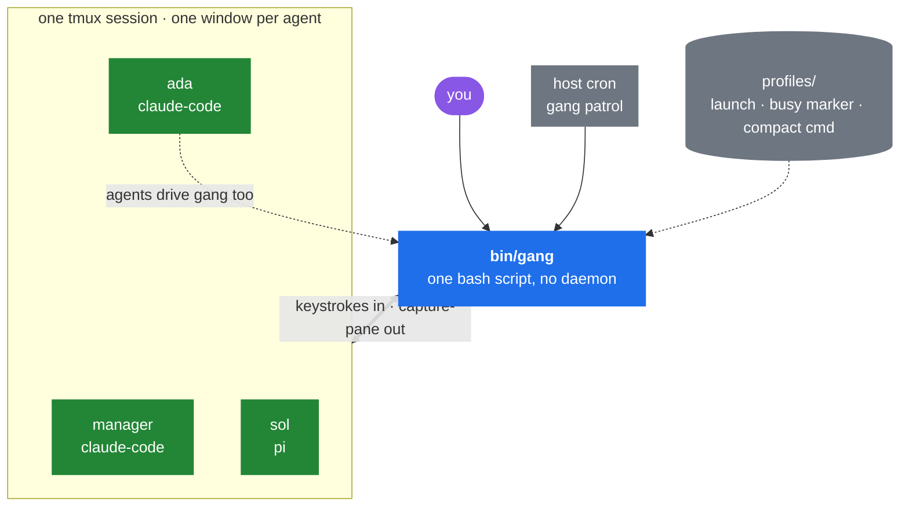
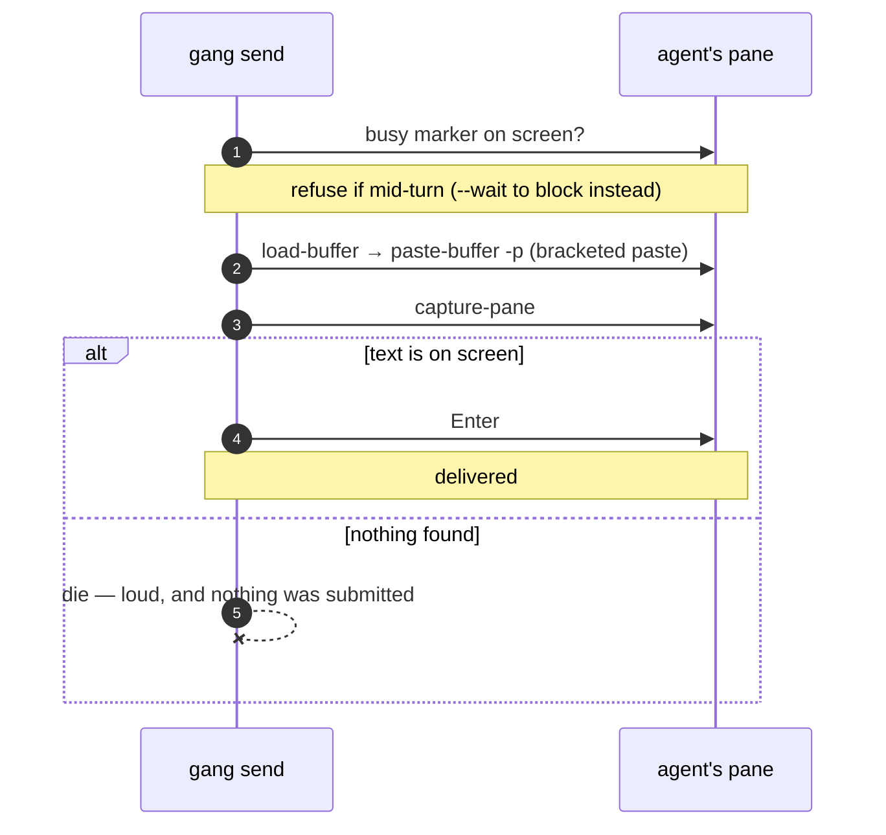
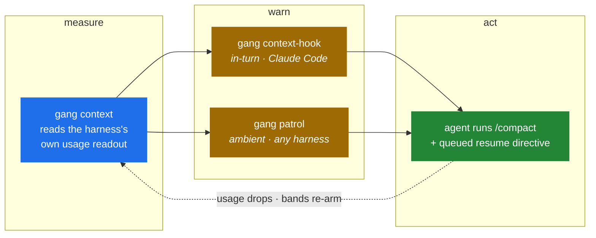

# Gangline

A harness harness. Gangline unifies any CLI coding agent it can get its hands on —
Claude Code, Pi, whatever ships next — into a tmux-powered team, using each for its
strengths, with minimal harness-specific integration points.

The name: a gangline is the single rope that hitches many dogs, each in its own
harness, to one sled and one musher. The integration point is the attachment clip —
never surgery inside the dog.



There is no server, no bus, and no database. tmux already holds the state, so
`gang` is a CLI you run and it exits.

## The three ideas

**Agents are tmux windows.** Spawning is `new-window`, killing is `kill-window`,
watching is `capture-pane`, and the window name *is* the agent's identity. Attach
to the session and you are looking at your team — the pane is the transcript, and
you can type into it yourself at any time.
[Read more →](#the-substrate)

**Every message is attributed and verified.** A send is pasted into the target
pane carrying a `[gang:<sender>]` prefix, confirmed by capturing the pane, and only
then submitted. No sender means no send. Unverified means a loud failure, never a
shrug. Sends into a mid-turn agent are refused rather than queued behind its work.
[Read more →](#the-substrate)

**Agents manage their own context.** A model cannot feel its own token count, so
the substrate measures it, warns the agent as it crosses configurable bands, and the
agent compacts *itself* at the next clean seam — queuing a resume directive behind
the compaction so work continues without a human waiting on it.
[Read more →](#self-compaction)

**A new harness costs a profile, not an integration.** Launch command, busy marker,
compact command — about ten lines. Everything else is universal.
[Read more →](#profiles)

## Quickstart

```sh
gang up -p claude-code -d ~/my/repo          # fresh start: session + your own window
                                             # ("manager", attached) — run from outside tmux
gang spawn ada -p claude-code -d ~/my/repo   # ada is now a tmux window running claude
gang send ada --from manager "read the failing test in ci and fix it"
gang status ada                              # busy | idle
gang capture ada                             # what's on ada's screen
gang roster                                  # everyone, with state
gang attach                                  # watch the whole team live
gang kill ada
gang down                                    # kill the whole team
```

## Install

```sh
ln -sf "$(pwd)/bin/gang" ~/.local/bin/gang
```

Requires tmux ≥ 3.2 (bracketed paste via `paste-buffer -p`).

---

## The substrate

`bin/gang` is the tool in full. Proven live: Claude Code and Pi agents in one team,
manager→worker tasking on both, and a cross-harness worker→worker relay
(`ada` → `gang send` → `sol`), every hop identity-prefixed and pane-verified.

Delivery is confirmed before submission, never assumed:



Some TUIs collapse a long paste into a placeholder rather than echoing it, so an
exact `[paste #N 1081 chars]` / `[paste #N +13 lines]` count match counts as
evidence too. A mismatched count does not.

Per-agent state lives in tmux window options — the profile binding (`@gl_profile`)
and the context band already warned about (`@gl_band`) — so tmux deletes an agent's
state along with its window, and a re-spawned name starts clean.

## Self-compaction

Measure, warn, act — the substrate does the first two, the agent does the third.



**Measure.** `gang context <name>` (and a roster column) reads context-window usage
through the profile's own introspection. Pi renders usage in its status bar
natively; Claude Code gets the shipped statusline beacon
(`statusline/claude-code-context.sh`, wired via `settings.json` `statusLine`) — the
statusline payload carries `context_window` figures and the beacon paints them into
the pane, where gang can read them.

**Warn.** Two legs, because one harness's hook system is not another's:

- `gang context-hook` is a Claude Code hook (UserPromptSubmit + PostToolUse) that
  injects one in-context note per crossed `GANG_CONTEXT_BANDS` threshold. Bare
  numbers are token counts, a `%` suffix is percent of window; the default ladder is
  `120000,180000,250000,90%`, re-armed when compaction drops usage.
- `gang patrol` is the harness-agnostic leg — a one-shot roster sweep that injects
  the same band note as `[gang:patrol]` into any agent that crossed a threshold
  since the last sweep. It exists because a harness may have no hook system at all
  (Pi's model never sees its own status bar). Patrol lives on a host cron, always-on,
  and no-ops cheaply when no session is running:

  ```
  */2 * * * * $HOME/.local/bin/gang patrol 2>&1 | grep -E 'NUDGED|re-armed|holding|stash|invalid' >> $HOME/.local/state/gangline/patrol.log || true
  ```

**Act.** `gang compact <name> [--resume <msg>]` triggers the harness's own
compaction command through the verified-injection path. The resume message is
injected *while* compaction runs, so the harness's own input queue holds it and
fires it when the compact turn ends — no idle gap, and no process babysitting the
wait. Proven live on Claude Code and Pi; a failed compact still releases the queue,
so an agent is never stranded. An agent past a band self-queues its own compact plus
a resume directive at the next arc seam, with no permission ask. Durable-state and
handoff conventions ride in agent prompts, not in code.

### What patrol refuses to do

Injecting into a pane that is not quietly idle corrupts it, so patrol skips rather
than risks it — and a skip never burns state, so the next sweep retries.

- **Busy agents** are skipped outright.
- **Churning panes** are held: patrol injects only into a pane that is byte-identical
  across two captures. Busy regexes are snapshots, and at a turn boundary or during a
  compaction redraw every guard reads a different frame — a nudge injected against a
  moving screen can jump the harness's own input queue and fire ahead of a queued
  resume directive. A quietly idle TUI paints a static screen, while streaming,
  spinners, and compaction progress bars all churn, so this gate scrapes no marker
  and cannot rot.
- **Non-empty input boxes** are guarded: a human draft, ghost-text suggestion, or
  queued-message hint would interleave with an injection. On a harness with a draft
  stash (Claude Code `chat:stash`, Ctrl+S) the draft is stashed, the nudge injected,
  and the draft preserved in the stash slot — the "› stashed" badge marks it and one
  Ctrl+S recovers it byte-perfect. Harnesses without a stash hold the nudge instead.

## Profiles

A profile is a few lines declaring what gang cannot know generically: the launch
command, the busy marker, the compact command, and optional hooks for reading a
context readout or detecting a non-empty input box.

```
bin/gang      the whole tool
profiles/     one small file per harness
statusline/   the Claude Code context beacon
docs/adr/     decisions
```

### Strategy rot

Profiles are scraped observations of TUIs, and TUIs change under you — a Claude Code
release once stopped painting "esc to interrupt" during tool execution, and busy
detection false-negatived. Every scraped marker (busy regex, context readout,
input-box shape) is live-verified against specific harness versions and pinned in
the profile with `GANG_VERSION_CMD` + `GANG_VERIFIED_VERSIONS` (space-separated
version prefixes; `any` means no scraped markers).

`gang doctor` compares each installed harness against its pin and exits nonzero on
drift. It is a reactive diagnostic, not a cron job: an agent that sees scraping
misbehave — false busy/idle, a missing context beacon, an injection that fails
verification — runs `gang doctor` first. On ROT RISK, `gang doctor --file-issue`
files a deduped rot issue via `gh`, then the markers get re-verified against the
live TUI and the new version appended to the pin.

## Contributing

`CONSTITUTION.md` holds the laws that bind every change here — read it first; Law 1
is that tmux is not a hack, it IS the substrate. `CONTRIBUTING.md` covers setup and
commit conventions.
