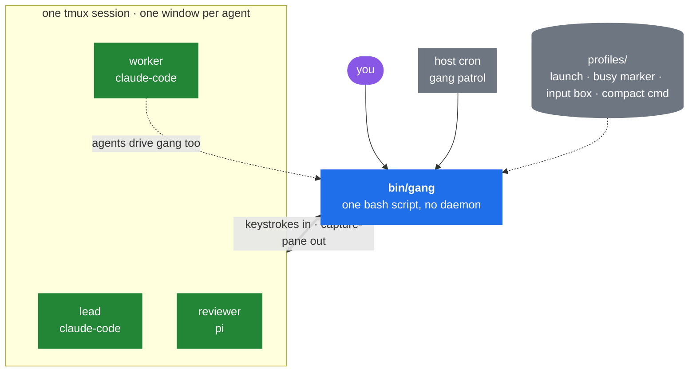
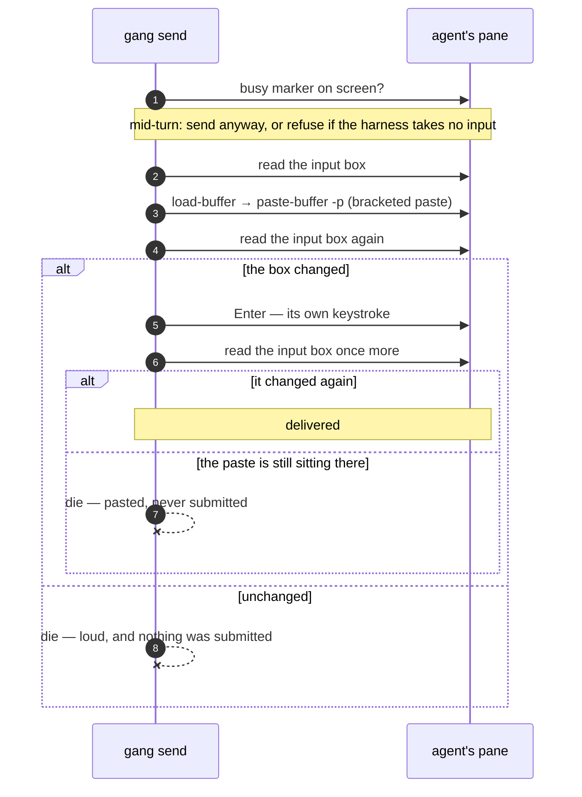
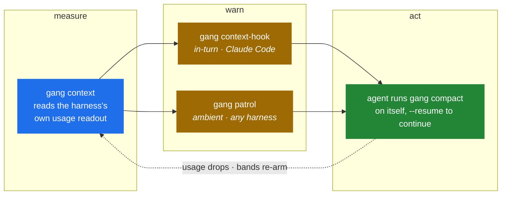

# Gangline

A harness harness. Gangline unifies any CLI coding agent it can get its hands on —
Claude Code, Codex, opencode, Pi, whatever ships next — into a tmux-powered team, using each
for its strengths, with minimal harness-specific integration points.

The name: a gangline is the single rope that hitches many dogs, each in its own
harness, to one sled and one musher. The integration point is the attachment clip —
never surgery inside the dog. The rest of the vocabulary keeps the frame —
[the musher's field guide](docs/field-guide.md) maps every term to its literal
meaning.



There is no server, no bus, and no database. tmux already holds the state, so
`gang` is a CLI you run and it exits.

## The five ideas

**Agents are tmux windows.** Hitching is `new-window`, dropping is `kill-window`,
watching is `capture-pane`, and the window name *is* the agent's identity. Attach
to the session and you are looking at your team — the pane is the transcript, and
you can type into it yourself at any time.
[Read more →](#the-substrate)

**Every message is attributed and verified.** A send is pasted into the target
pane inside a `[gang:<sender>#<nonce>] … [/gang:<sender>#<nonce>]` envelope,
confirmed against the harness's input box, and only then submitted. The envelope
is what makes attribution mechanical rather than decorative: every line the
sender wrote is inside it, so a body cannot emit the unenveloped line a
receiving agent reads as the operator speaking, and a caller running inside the
session is signed as its own window rather than as whatever it claims. No sender
means no send. Unverified means a loud failure, never a shrug. A mid-turn agent
is still reachable: where the harness takes input during a turn, the message is
accepted instead of bouncing.
[Read more →](#the-substrate)

**Agents manage their own context.** A model cannot feel its own token count, so
the substrate measures it, warns the agent as it crosses configurable bands, and the
agent compacts *itself* at the next clean seam, naming what to pick back up, so
work continues without a human waiting on it.
[Read more →](#self-compaction)

**A new harness costs a profile, not an integration.** Launch command, busy marker,
compact command — about ten lines. Everything else is universal.
[Read more →](#profiles)

**Batteries included, every one replaceable.** Agents are hitched with a role brief —
lead, worker, reviewer — telling them how to address teammates, when to compact,
and what to do when the substrate misbehaves. Point `GANG_ROLES` at a directory of
your own and any brief becomes yours.
[Read more →](#the-playbook)

## Quickstart

```sh
cd ~/my/repo && gang up                         # the whole setup, no arguments: hitches
                                                # "lead" here on claude-code with the
                                                # lead role, and puts you in the session
gang hitch worker -r worker                     # "worker" is a name you pick: it becomes the
                                                # tmux window name AND the agent's identity;
                                                # -r briefs it with a role (gang roles)
gang hitch heavy -m claude-fable-5              # -m launches on a specific model, spelled
                                                # the harness's own way; the profile knows
                                                # which flag carries it
gang send worker --from lead "read the failing test in ci and fix it"
gang status worker                              # busy (tight tug) | idle (slack tug)
                                                # | gated (hook set — see Permissions)
gang capture worker                             # what's on worker's screen
gang roster                                     # everyone, with state
gang attach                                     # watch the whole team live
gang drop worker                                # release the agent — deliberate, routine
gang down                                       # end the whole session
```

Output is coloured on a terminal and nowhere else: red for an agent that needs a
human, amber for one that is working, green for what gang just did, dim for the
detail behind it. A pipe, a capture, or a cron log gets the same text plain — the
roster an agent greps must not depend on where it was run — and `NO_COLOR=1`
turns it off everywhere.

## Install

```sh
curl -fsSL https://raw.githubusercontent.com/adambiggs/gangline/main/install.sh | sh
```

Clones to `~/.local/share/gangline` and links `gang` into `~/.local/bin`; re-run it
to update. `GANGLINE_HOME` and `GANGLINE_BIN` move either. If you would rather not
pipe a script into a shell, read [`install.sh`](install.sh) first — a clone and a
symlink is all it does.

From a clone instead:

```sh
ln -sf "$(pwd)/bin/gang" ~/.local/bin/gang
```

Requires git, tmux ≥ 3.2 (bracketed paste via `paste-buffer -p`), and python3 —
which reads every harness's context figures, builds the context-hook reply, and
runs `gang vet`'s file-format gates. macOS ships no python3 by default.

---

## The substrate

`bin/gang` is the tool in full. Proven live: Claude Code and Pi agents in one team,
lead→worker tasking on both, and a cross-harness relay in which a Claude Code
agent used `gang send` to task a Pi agent, which acted on it — every hop
identity-prefixed and pane-verified. Codex has been driven the same way end to end —
hitched, briefed, tasked, reached mid-turn, and compacted with a `--resume` it
answered on the other side. So has opencode — hitched, tasked, read busy mid-turn,
and its context read live through the catalog join described below.

Agent names are yours. Whatever you pass to `gang hitch` becomes the tmux window
name, the identity every message is signed with, and the handle every command
takes. Name them for the role they play on the team. Letters, digits, dot, dash
and underscore only — a name also has to survive being a tmux target, a JSON
string in a hook reply, and a word in a suggested command. Underneath the
handle, gang addresses windows by tmux window id — immutable, never reused — so a rename, a
reorder, or a name that happens to look like a number cannot re-point a command
at the wrong agent.

Delivery is confirmed before submission, never assumed:



Three reads, because neither presence nor absence proves anything alone. Matching
the text *somewhere* on screen would verify against an identical earlier send
still sitting in the transcript; a box that **changed** is the harness-independent
fact underneath every TUI's rendering, whether it echoes a paste literally or
collapses it into `[Pasted text #2]` or `[paste #N +13 lines]`. The third read is
the submit: batch the text and the Enter into one keystroke burst and a TUI reads
the newline as part of the paste, leaving the message parked in the box as an
unsent draft that scrollback renders exactly like a sent one.

Per-agent state lives in tmux window options — the profile binding (`@gl_profile`)
and the context band already warned about (`@gl_band`) — so tmux deletes an agent's
state along with its window, and a re-hitched name starts clean.

## Self-compaction

Measure, warn, act — the substrate does the first two, the agent does the third.



**Measure.** `gang context <name>` (and a roster column) reads context-window usage
through the profile's own introspection. Pi renders usage in its status bar
natively; Claude Code gets the shipped statusline beacon
(`statusline/claude-code-context.sh`, wired via `settings.json` `statusLine`) — the
statusline payload carries `context_window` figures and the beacon paints them into
the pane, where gang can read them. Every consumer — `gang context`, the roster
column, and both warning legs below — reads that one readout, so nothing in the
system can disagree with anything else about how full a window is.

A profile can also read the harness's own files instead of the screen. Codex
paints no readout a passive observer can reach — its hint-row figure appears only
while the composer holds text — so its profile reads the session rollout Codex
itself appends every turn: a `token_count` event carrying the last turn's usage
and the model's context window. The link from a tmux window to the right rollout
is a session marker gang mints at hitch, plants in the agent's first message
(where the rollout records it verbatim), and keeps in window state; lookup
refuses to guess whenever the marker is not exactly one rollout's user input.
The two sources also mix: opencode paints used tokens and a rounded percent but
never the window, so its profile scrapes the pane for what is painted and joins
the window from opencode's own models catalog on disk, keyed by the painted
model badge — then requires the painted percent to reproduce from the join
before trusting it. A profile with no path to the figure at all still declines
loudly: `gang context`
fails, the roster column shows `-`, and patrol reports it as not patrolled
instead of quietly skipping it. An unread window is a worse thing to hide than
to admit.

**Warn.** Two legs, because one harness's hook system is not another's:

- `gang context-hook` runs inside the agent's own pane, invoked by the harness's
  hook system (Claude Code: UserPromptSubmit + PostToolUse), and returns one
  in-context note per crossed `GANG_CONTEXT_BANDS` threshold. Bare numbers are
  token counts, a `%` suffix is percent of window; the default ladder is
  `120000,180000,250000,350000`, re-armed when compaction drops usage. Every
  default rung is absolute because context rot tracks absolute length, not how
  full the window happens to be — a 300k context is degraded whether the window
  is 200k or 1M, and a proportional rung would call 900k of a 1M window fine.
- `gang patrol` is the ambient leg — a one-shot roster sweep that injects the same
  band note as `[gang:patrol]` into any agent that crossed a threshold since the
  last sweep. It exists because a harness may have no hook system at all
  (Pi's model never sees its own status bar). Patrol lives on a host cron, always-on,
  and no-ops cheaply when no session is running. Nothing creates the log's
  directory for you, and cron's `|| true` would swallow the failed redirect, so
  make it once:

  ```
  mkdir -p "$HOME/.local/state/gangline"
  ```

  ```
  */2 * * * * $HOME/.local/bin/gang patrol 2>&1 | grep -v ' steady ' >> $HOME/.local/state/gangline/patrol.log || true
  ```

  The filter drops the one boring line rather than keeping a list of interesting
  ones, so a failure gang has not thought of yet still reaches the log. Patrol
  sweeps `GANG_SESSION` only — a second team wants a second line.

Both legs run the same ladder over the same readout and share one band memory
(`@gl_band`, a window option), so whichever notices a crossing first advances the
band and the other reports steady. An agent is warned once per band, not once per
leg, and tmux deletes the memory with the window.

**Act.** `gang compact <name> [--resume <msg>]` triggers the harness's own
compaction command through the verified-injection path. Naming *yourself* is the
ordinary case and the one the pillar rests on: compaction queues behind the turn
you are in — the turn that ends the moment the command returns — so an agent past
a band compacts at its next arc seam without being idle first, without permission,
and without anyone watching. Naming somebody else still refuses a live turn,
because cutting one throws away work in progress; that refusal is about what
compaction *means*, not about whether keystrokes can be delivered.

`--resume` never rides the input queue behind its own compaction. Queued input is
not one thing: text can be handed to the turn already running while a queued slash
command waits for that turn to end, so a resume typed in behind a compaction
arrives *before* it and is swallowed by the turn that was about to be compacted —
the agent then wakes up with nothing to pick up. A detached waiter delivers it
instead, at the first moment it cannot be overtaken. That moment is when the
compaction is visibly *running*: the turn that could have eaten the resume is over,
and the turn now in flight reads no input, so the message can only wait — which is
all it ever had to do. It goes into the queue the compaction drains on its way out,
and the agent picks it up the instant it has a context to pick it up into.

Profiles declare what their compaction looks like on screen
(`GANG_COMPACTING_REGEX`). One whose compaction nobody has watched live declares
nothing and waits for the pane to go quiet instead — three consecutive polls and a
screen that has stopped repainting, floored so it cannot fire in the gap between
the turn ending and compaction starting to draw. Slower, correct, and no marker to
rot. Durable-state and handoff conventions ride in agent prompts, not in code.

### What patrol refuses to do

Injecting into a pane that is not quietly idle corrupts it, so patrol skips rather
than risks it — and a skip never burns state, so the next sweep retries.

- **Busy agents** are skipped outright.
- **Churning panes** are held: patrol injects only into a pane that is byte-identical
  across two captures. Busy regexes are snapshots, and at a turn boundary or during a
  compaction redraw every guard reads a different frame — a nudge injected against a
  moving screen can jump the harness's own input queue and fire ahead of a queued
  resume directive. A quietly idle TUI paints a static screen, while streaming,
  spinners, and compaction progress bars all churn, so this gate scrapes no marker
  and cannot rot.
- **Non-empty input boxes** are guarded: a human draft, ghost-text suggestion, or
  queued-message hint would interleave with an injection, so the nudge is held
  until the box is clear. Holding costs one sweep; interleaving costs the turn.
- **Gated agents** are reported, never nudged: a harness stopped at a permission
  prompt (`GANG_GATED_REGEX`) is waiting on the operator, and keystrokes sent to
  it would *answer the dialog* — so every delivery path refuses, `status` and
  `roster` say `gated (hook set)`, and patrol names it loudly instead of skipping
  it. Every gate watched live also drops its busy hint and input box, so without
  the marker a gated agent reads idle and the team stalls with nothing saying why.

## Permissions

**gangline launches each harness exactly as you have configured it** and sets no
permission flags of its own. What your harness asks you, it asks a gangline
agent too.

Worth knowing before you hitch a team, because a gangline agent is unattended by
construction: nobody is watching its pane, an approval dialog stops the whole
team mid-arc, and gang will not answer one for you — every delivery path reports
the gate and refuses. A harness left on its interactive defaults stalls a team at
the first prompt. That belongs in the harness's own persistent config, where you
can see it and change it back:

- **Claude Code** — `"permissions": { "defaultMode": "auto" }` in
  `~/.claude/settings.json`; `acceptEdits`, `dontAsk` and `bypassPermissions` sit
  further along the same dial.
- **Codex** — `approval_policy = "never"` in `~/.codex/config.toml`, plus the
  network setting below, which a Codex agent needs before it can reach the team
  at all.
- **opencode** — nothing to do by default: vanilla opencode asks nothing, and
  gates exist only where your own `opencode.json` has a `"permission"` block
  saying `"ask"`. Launch it with `--auto` to override those.
- **pi** — no approval system to disarm.

Each harness prints its own warning about what these modes mean, in its own
words. That message is theirs to make; gangline does not repeat it, soften it,
or add a second one.

> **The one thing gangline has to say that your harness does not.** gang moves
> text between agents: one agent's output becomes another agent's input, carried
> by a tool with no way to know whether it was reasoning or an instruction a
> repository planted. A poisoned file read by one agent can therefore reach the
> shell of another. Treat every agent's output as untrusted input to the next,
> keep a team on work you would run yourself, and bound the machine — a
> container, a VM, an account — if you need a boundary. Relocating `$HOME` is
> not one: same uid, same files, same network.

Prefer to change a launch line instead? Every flag lives in one line of a
profile's `GANG_LAUNCH`: shadow the profile via `GANG_PROFILES` and patch that
line (see Profiles). Nothing else in gang changes with it — the scraping surface
is the same file. What gang will never do is answer a dialog for you or pre-trust
a directory on your behalf.

### A sandboxed Codex agent needs network access to answer

gang's control path is the tmux socket, and Codex's sandbox gates `connect()` on
its network toggle without discriminating by address family — so a Codex agent
with network access denied cannot open a *unix* socket either. The block is on
the syscall, not the path to it: adding writable roots does not reach it, and
neither does `TMUX_TMPDIR`.

Watched live, same socket and command, one variable. Under `workspace-write`,
`tmux -S <socket> ls` returns `Operation not permitted`; with `network_access`
turned on it lists the session, and a Codex worker hitched that way answered
`gang roster` and reported home through `gang send`.

Denied, the traffic is one-way rather than dead: gang writes into the pane from
*outside* the sandbox, so briefs and messages arrive, while everything the agent
runs itself fails — `gang send` back to its lead, `gang roster` (`no team` from
inside its own pane), and its own self-compaction. A lead waiting on that
worker's report waits forever, and the worker looks stuck at the moment it
finished.

So a Codex worker wants this in `~/.codex/config.toml`, which keeps its landlock
filesystem confinement and buys back the socket:

```toml
sandbox_mode = "workspace-write"

[sandbox_workspace_write]
network_access = true
```

Read what that costs before you set it: network access is network access, so the
agent reaches the internet as well as the socket. It is still the smaller of the
two doors — `danger-full-access` takes the filesystem boundary down with it.

## Profiles

A profile is a few lines declaring what gang cannot know generically: the launch
command, the busy marker, the compact command, the flag that names a model
(`GANG_MODEL_OPT`, what `hitch -m` appends — a profile without it refuses the
flag), whether the harness takes input during a turn, what its compaction looks
like while it runs, how its permission prompt reads, and optional hooks for
reading a context readout and for finding the harness's input box. The
behavioural ones — mid-turn input, the compaction
marker, and the gate marker — are optional in the honest sense: unset means
nobody has watched that behaviour live, and gang takes the slower, safer branch
rather than guessing at it.

That last hook earns its keep twice. Its contents say whether a paste would land
on top of a draft, and its mere presence says the harness is up: for the first
seconds after launch a TUI paints nothing, and an empty pane is a perfectly
stable one, so waiting for the screen to settle declares an agent ready before it
can read a byte of stdin. Waiting for the box instead is direct evidence. Its
*contents* are deliberately ignored there — a fresh TUI paints ghost text into
its own empty box, and an agent two seconds old would never be briefed at all.

```
bin/gang      the whole tool
install.sh    clone + link, idempotent
profiles/     one small file per harness
roles/        one markdown brief per role
statusline/   the Claude Code context beacon
test/         integration test, real tmux, no mocks
docs/adr/     decisions
```

## The playbook

A profile says how to talk to a harness; a role says what an agent is for. They
are the same kind of extension point, and neither is code — a role is a markdown
brief, because law 9 says the answer is prose in an agent's prompt.

```sh
gang hitch worker -p claude-code -r worker -d ~/my/repo
gang roles                                    # lead, reviewer, worker
```

The shipped briefs carry what an agent cannot work out from its own transcript:
that an enveloped message is a peer and unenveloped text is the operator, that
a send to a busy agent is accepted rather than bounced, that a
`[context-usage]` note means finish the arc and `gang compact` yourself with a
`--resume`, and that `gang vet` explains a substrate behaving strangely.
`roles/_common.md`
holds all of that; each role file adds its own job on top — the lead splits
work by ownership and guards its own context hardest, the worker reports what
changed and what proves it, the reviewer verifies claims rather than reading
diffs.

The brief is pointed at, not pasted: gang injects one line naming the files, the
agent reads them, and they stay on disk to be re-read after a compaction. That
also keeps the injection short enough to verify — a paste taller than the pane
cannot be.

Replace any of it by putting a file of the same name in a directory of your own.
Both halves work the same way, and both are searched before the shipped ones, so
a new harness — or a fix to a profile whose TUI has moved on — costs a file, not
a patch to the installed tree:

```sh
export GANG_ROLES=~/my/gangline-roles         # searched before the shipped roles/
export GANG_PROFILES=~/my/gangline-profiles   # searched before the shipped profiles/
```

Export them from your shell profile, not just your interactive shell: `gang
patrol` runs from cron, and an agent whose profile it cannot resolve is listed
with `profile not found` rather than dropped from the roster.

### Strategy rot

Profiles are scraped observations of TUIs, and TUIs change under you — a Claude Code
release once stopped painting "esc to interrupt" during tool execution, and busy
detection false-negatived. Every scraped marker (busy regex, context readout,
input-box shape) is live-verified against specific harness versions and pinned in
the profile with `GANG_VERSION_CMD` + `GANG_VERIFIED_VERSIONS` (space-separated
version prefixes; `any` means no scraped markers).

`gang vet` compares each installed harness against its pin and exits nonzero on
drift. A profile that reads harness files instead of the screen rots on a schema
change rather than a TUI change, so it declares a `profile_vet` format gate —
vet runs the profile's own parser against the newest session file on disk and
counts a failure as drift. It is a reactive diagnostic, not a cron job: an agent that sees scraping
misbehave — false busy/idle, a missing context beacon, an injection that fails
verification — runs `gang vet` first. On ROT RISK, `gang vet --file-issue`
files a deduped rot issue via `gh`, then the markers get re-verified against the
live TUI and the new version appended to the pin.

Version pins watch the harness, not its mods. A theme, a replacement statusline,
or a TUI-drawing extension — a permission system, say — repaints chrome without
moving any version vet checks, so scraping can misbehave while every row
reads OK; vet says so whenever it hands back a clean bill. Additive
extensions (MCP servers, hooks, slash commands) add capability without touching
the chrome the markers match. What a mod cannot do is turn a keystroke loose:
delivery verifies the input box changed, before and after, so a marker moved by
a mod degrades to loud refusals and held nudges, never a paste into the wrong
widget. When one does move a marker, the repair is the same lane a new harness
uses — a `GANG_PROFILES` shadow re-verified against the TUI as you actually run
it, with `GANG_VERSION_CMD` pointed at something that includes the mod's own
version, so the pin watches the thing that owns the pixels. `profiles/pi.sh`
documents the pattern for extension-drawn permission dialogs.

## Contributing

`CONSTITUTION.md` holds the laws that bind every change here — read it first; Law 1
is that tmux is not a hack, it IS the substrate. `CONTRIBUTING.md` covers setup and
commit conventions.

## License

Apache-2.0 — see [`LICENSE`](LICENSE). Copyright 2026 Adam Biggs.
