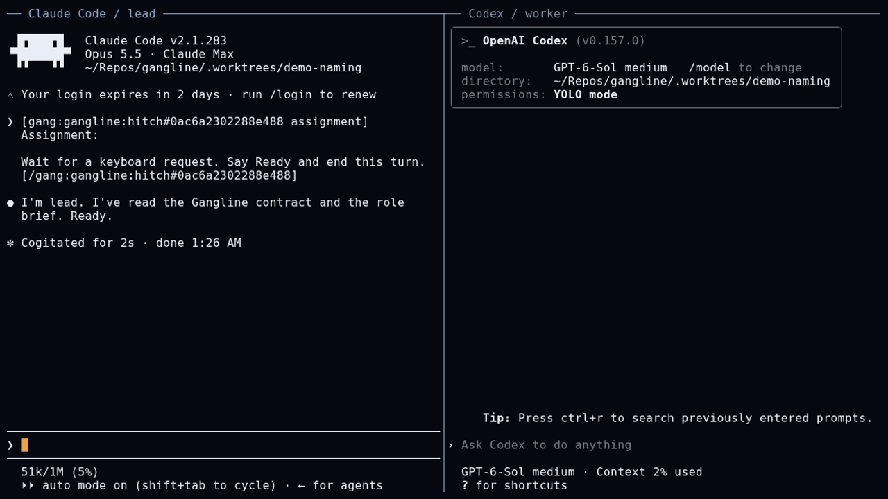

# Gangline

Gangline puts Claude Code and Codex agents in a tmux team. Each keeps its own
terminal, tools, permissions, and history. You can give agents separate jobs,
send messages by name, and watch their work from the terminal.

Gangline is opinionated about coordination mechanics: named agents, hitching
(launching an agent), collars (files that define harness integration),
attributed message delivery, a startup contract, lifecycle logs, and context
compaction. Your instructions define the work, who decides what
gets built, and how review and acceptance run; Gangline does not manage tasks
or claims.

Use it when you want to hand a result to a lead and let it recruit teammates,
while you can inspect or steer any agent. Install Gangline as shown in the
[quickstart](docs/quickstart.md#install):

```sh
curl -fsSL https://raw.githubusercontent.com/adambiggs/gangline/main/install.sh | sh
```

Then start in your repository:

```sh
gang up -c claude
```

Then tell the lead what you want:

> Ask a Codex worker to find how this repository runs its tests. Have it send
> you the command and supporting file paths, then summarize the answer for me.

The lead can brief a worker, receive its report, and bring the result back.
Watch their tmux panes in separate windows or a shared split layout. Your instructions decide
their assignments and staffing.

<picture>
  <source media="(prefers-color-scheme: dark)" srcset="site/demo.gif">
  <source media="(prefers-color-scheme: light)" srcset="site/demo-light.gif">
  
</picture>

The Claude Code lead asks a Codex worker to finish an animated greeting. The
worker edits and runs it, reports back, and the finished animation plays.
[Read the demonstration transcript](site/demo.txt).

Start with [your first team](docs/quickstart.md). Then use the
[guides](docs/guides.md) for daily tasks, [concepts](docs/concepts.md) for the
mental model, and [reference](docs/reference.md) for commands and settings.
[Troubleshooting](docs/troubleshooting.md) starts from what you can see;
[internals](docs/internals.md) explains the implementation and design choices.

Gangline is licensed under Apache-2.0. See [contributing](CONTRIBUTING.md)
and [security reporting](SECURITY.md).
